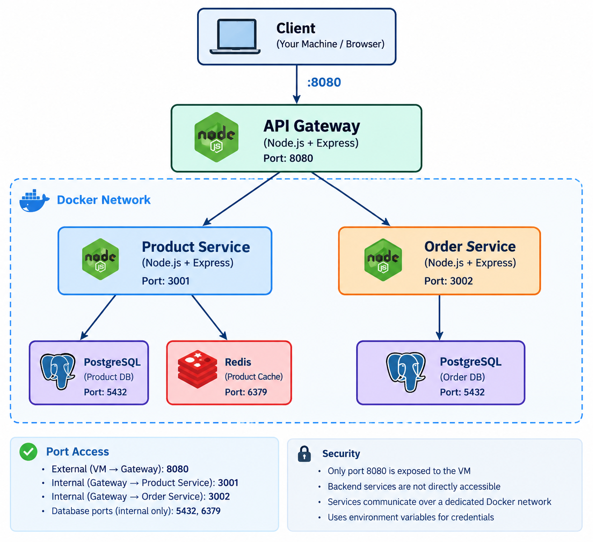
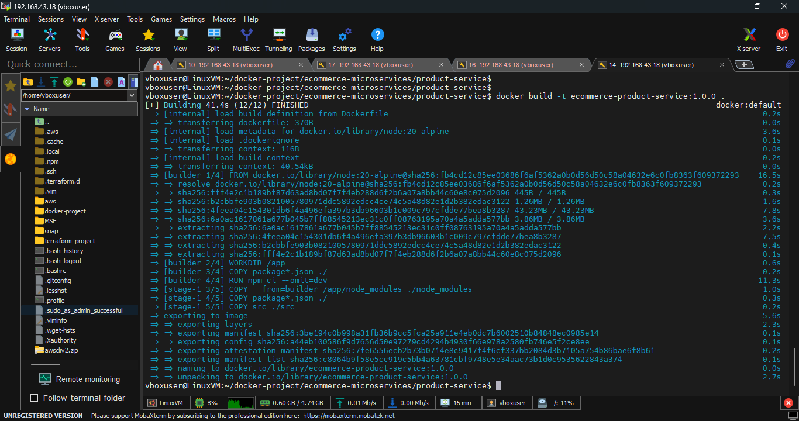
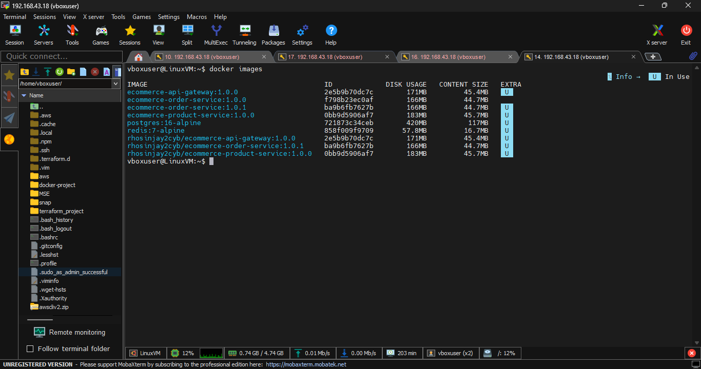
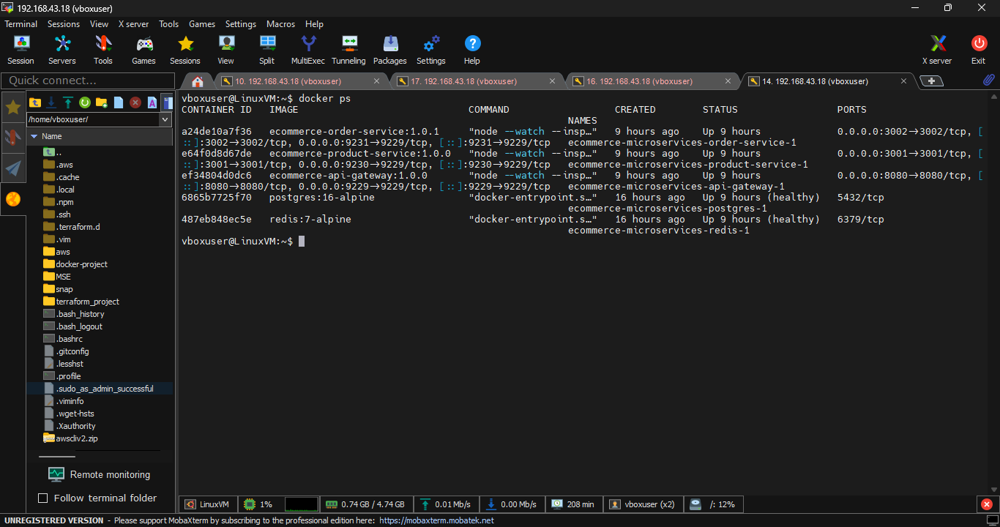
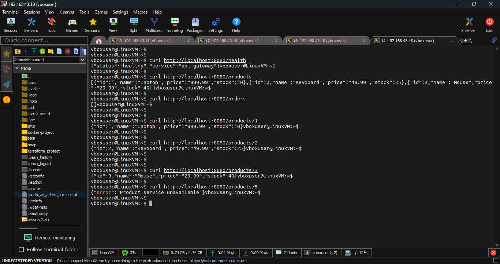
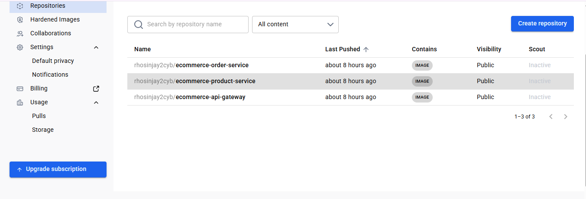

## E-commerce Microservices Application

A containerized e-commerce application built using a microservices architecture. The platform consists of an API Gateway, Product Service, and Order Service, with PostgreSQL used for persistent data storage and Redis used for caching.

### Architecture

The application consists of three Node.js microservices:

- **API Gateway** – external entry point for client requests.
- **Product Service** – manages product data using PostgreSQL and Redis.
- **Order Service** – manages customer orders using PostgreSQL.
- **PostgreSQL** – persistent relational database.
- **Redis** – caching layer for product data.

### Technical Requirements
It meets the folllowing requirements
Docker requirements:

* All Dockerfiles use multi-stage builds
* All images use Alpine or distroless base
* All containers run as non-root users
* All services have HEALTHCHECK instructions
* Layer caching is optimized (dependencies before source code)
* No secrets in any image layer

Compose requirements:

* Health check dependencies (depends_on with condition: service_healthy)
* Named volumes for all persistent data
* Custom network with proper service isolation
* Environment variables for all configuration (no hardcoded values)
* Resource limits (CPU and memory) on all services

### Results
Below is an highlight of results indicating the successful configuration of the project

#### Container Image Build

Building one of the images

#### List of Images

List of images with relevant tags 

#### Container Images Running

The five containers running 3 node.js application with postgres and redis

#### Testing the application

*curl http://localhost:8080/health*
*curl http://localhost:8080/products
curl http://localhost:8080/orders*
 

#### Images pushed  to repos in DockerHub

### Conclusion
This project demonstrated how to containerize and deploy a microservices-based e-commerce application using Docker and Docker Compose. Beyond that, it provided hands-on experience applying container security principles to a microservices application. I implemented non-root containers, multi-stage builds, service isolation through a dedicated Docker network, health checks, controlled port exposure, and environment-based secret management, demonstrating how secure-by-design practices can reduce the attack surface while maintaining a functional and deployable application.
